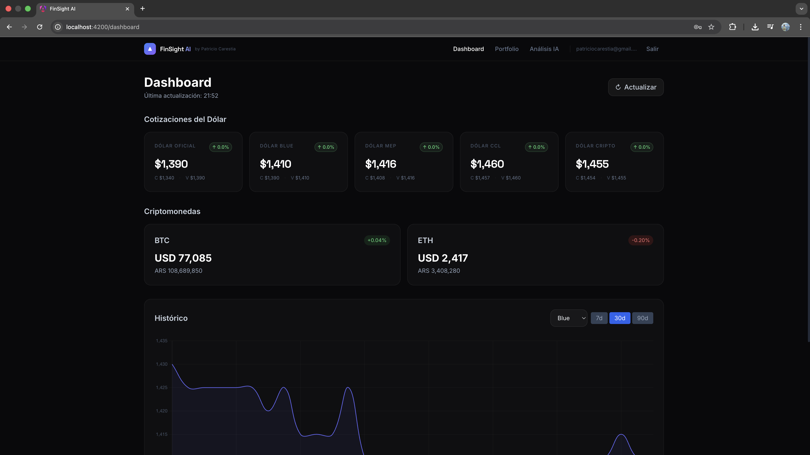
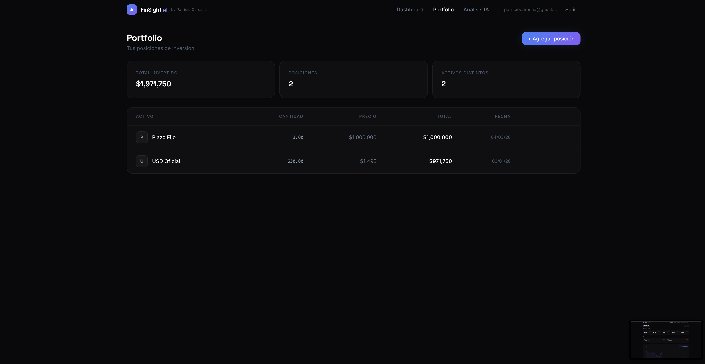
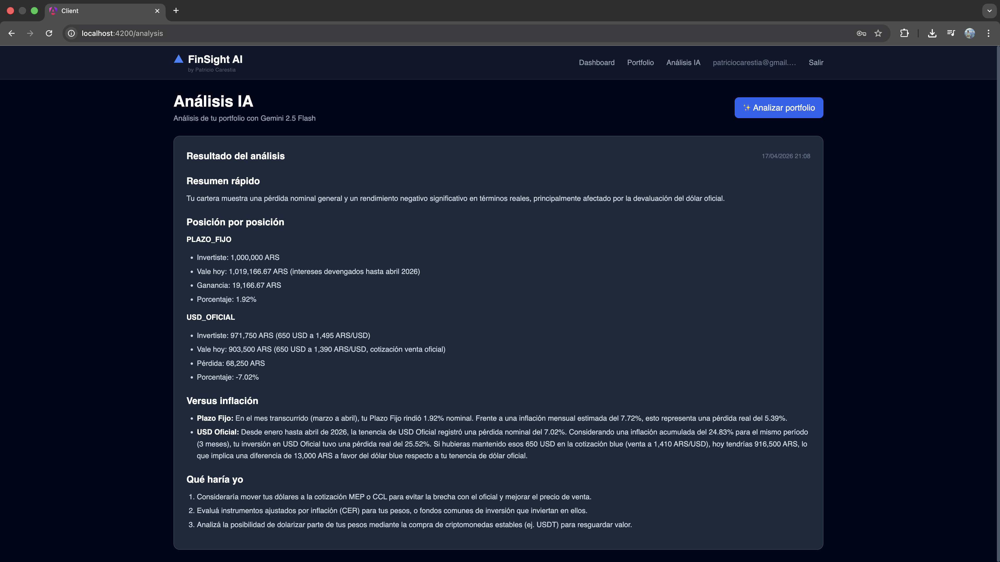

# FinSight AI

> A real-time financial dashboard that tracks Argentine exchange rates and crypto, and calculates actual portfolio returns adjusted for inflation — solving a real problem in a multi-currency economy.

[](https://github.com/patriciocarestia/finsight-ai/actions)


**[Live Demo](https://finsight-ai.azurestaticapps.net)** · **[API Docs](https://finsight-ai-api.azurewebsites.net/swagger)**

---

## Screenshots

### Dashboard



### Portfolio



### AI Analysis



---

## The Problem

Argentina has multiple parallel exchange rates (Oficial, Blue, MEP, CCL, Cripto), each with different legality and accessibility. Investors need to track holdings across ARS cash, USD blue, USDT, crypto, and Plazos Fijos — then compare returns against inflation (historically ~140%/year). No single tool does this.

---

## Features

- **Live exchange rates** — Dólar Oficial, Blue, MEP, CCL, Cripto refreshed every 15 minutes
- **Crypto prices** — BTC and ETH in both USD and ARS
- **Historical charts** — 7d / 30d / 90d price history with interactive charts
- **Portfolio tracker** — add positions in any asset type with purchase price and date
- **AI analysis** — Gemini 2.5 Flash analyzes your portfolio in Spanish, comparing returns vs inflation and USD Blue
- **JWT authentication** — secure per-user portfolio data

---

## Tech Stack

| Layer    | Technology                                                    |
|----------|---------------------------------------------------------------|
| Frontend | Angular 21, TypeScript, NgRx, Signals, Tailwind CSS, Chart.js |
| Backend  | .NET 10, C#, Clean Architecture, MediatR (CQRS)               |
| Database | SQLite (EF Core code-first)                                   |
| AI       | Google Gemini 2.5 Flash                                       |
| Jobs     | Hangfire (in-process scheduled jobs)                          |
| Auth     | JWT Bearer tokens                                             |
| CI/CD    | GitHub Actions                                                |
| Hosting  | Azure Static Web Apps + Azure App Service F1                  |

---

## Architecture

```
┌─────────────────────────────────┐
│         Angular 21 SPA          │
│  NgRx Store · Signals · Charts  │
└────────────────┬────────────────┘
                 │ HTTP + JWT
┌────────────────▼────────────────┐
│       ASP.NET Core Web API      │
│  Controllers → MediatR → CQRS   │
├─────────────────────────────────┤
│ Application Layer (Use Cases)   │
│  Commands · Queries · Handlers  │
├─────────────────────────────────┤
│ Infrastructure Layer            │
│ EF Core · Repositories ·        │
│ DolarAPI · CoinGecko · Gemini   │
├─────────────────────────────────┤
│ SQLite Database                 │
└─────────────────────────────────┘
         ▲
  Hangfire (every 15 min)
  fetches & stores rates
```

---

## API Endpoints

| Method | Route                                  | Auth | Description                     |
|--------|----------------------------------------|------|---------------------------------|
| POST   | `/api/auth/register`                   | 🔓   | Create account                  |
| POST   | `/api/auth/login`                      | 🔓   | Get JWT token                   |
| GET    | `/api/rates/latest`                    | 🔓   | Current exchange + crypto rates |
| GET    | `/api/rates/history?type=blue&days=30` | 🔓   | Historical rate data            |
| GET    | `/api/portfolio`                       | ✅   | User's positions                |
| POST   | `/api/portfolio`                       | ✅   | Add position                    |
| PUT    | `/api/portfolio/{id}`                  | ✅   | Update position                 |
| DELETE | `/api/portfolio/{id}`                  | ✅   | Delete position                 |
| POST   | `/api/analysis`                        | ✅   | Trigger AI analysis             |

---

## Project Structure

```
finsight-ai/
├── src/
│   ├── FinsightAI.API/
│   ├── FinsightAI.Application/
│   ├── FinsightAI.Domain/
│   ├── FinsightAI.Infrastructure/
│   └── FinsightAI.Tests/
└── client/                      # Angular 21 SPA
    └── src/app/
        ├── core/
        ├── features/
        ├── shared/
        └── store/
```

---

## Future Improvements

- Price alerts
- Portfolio performance over time
- Export to CSV/PDF
- Support for CEDEARs and acciones argentinas
- Social comparison (anonymous benchmarks)

---

Built by [Patricio Carestia](https://www.linkedin.com/in/patriciocarestia/) · Full Stack Engineer · Argentina
